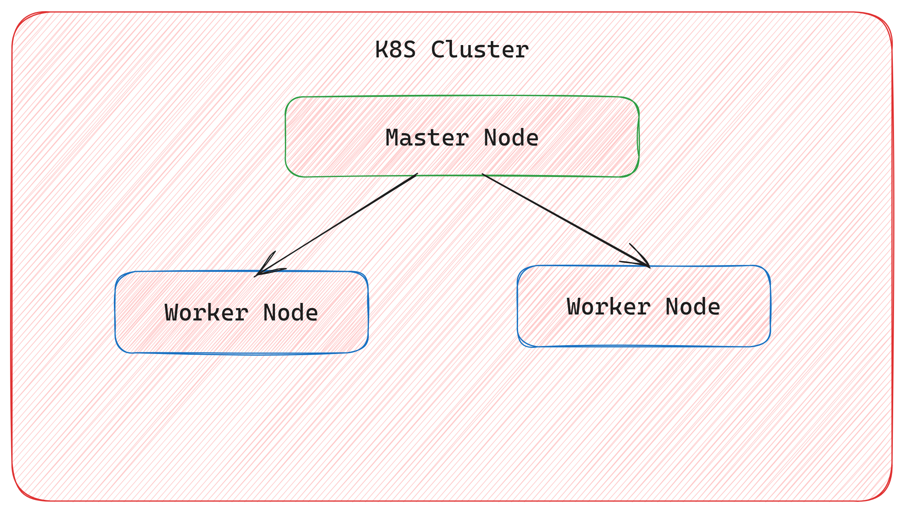
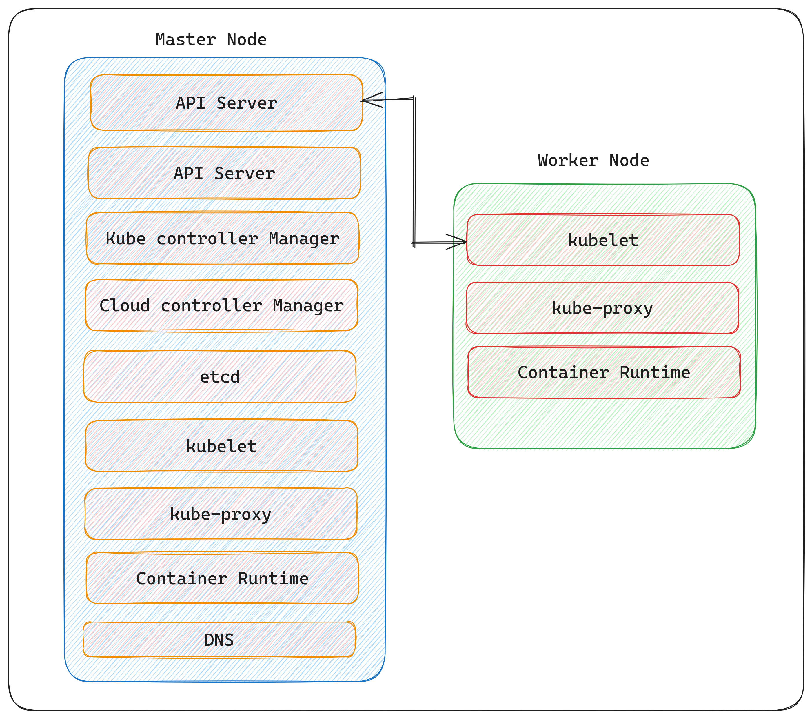
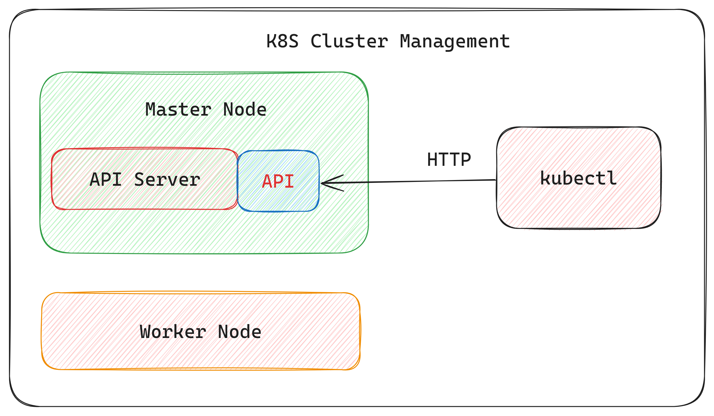
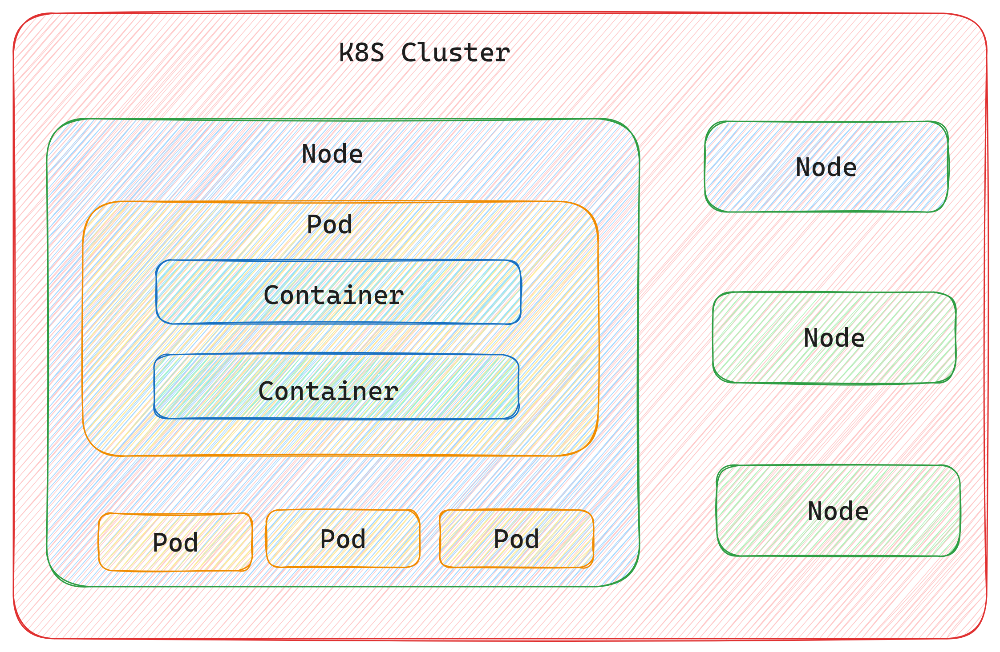

# K8s
### K8s takes care of automatic deployment of containeraised applications across different servers
### Distribution of load across multiple servers
### Auto-scaling of deployed application
### Monitoring and helth checks of containers
### Replcacement of failed containers

## Get Namespaces
### kubectl get namespaces
## Details of specific namespace
### kubectl get namespaces grafana-prometheus
## Full details
### kubectl describe namespaces grafana-prometheus
## Create Namespace uwing yaml
### Create yaml file add bellow code 
```

apiVersion: v1

kind: Namespace

metadata:

    insert-namespace-name-here
```
### Then run kubectl create -f ./my-namespace.yaml
## Create namespace without yaml
### kubectl create namespace insert-namespace-name-here
## Delete namespace
### kubectl delete namespaces insert-some-namespace-name
##  Command to deploy application to k8s cluster
### kubectl create deployment new-proms-proj --image=dasari508201/grafana-prometheus:0.0.1
## Expose service to outside world
### kubectl expose deployment new-proms-proj --type=LoadBalancer --port=8008
## Events that occured 
## K8s cluster
### In k8s cluster there is one master node and multiple worker nodes.
### Master node manages worker node. like distubuting load acros worker nodes


### Master node like control pannel
## K8S Service
### Master node service

### 1. kubelet

### 2. kube-proxy : Networks comminication inside node and between multiple nodes.

### 3. Container Runtime : runs containers inside each node.

### 4. API-Server: 
#### Provides communication between different nodes. and we can manage cluster using this service
### 5. Scheduler : 
#### Plan and distrubution of load between nodes.
#### Scheduling pods and nods based on memory and health
### 6. Kube Control Manager : It is controller in cluster, it tells what need to happen in cluster.
### 7. Cloud controller Manager : provides interaction between cloud provider.
### 8. etcd (Distributed Database)
#### Configuration changes,deployment,scaling and other operation changes are stored in etcd.
#### Desired state of cluster stored in etcd.
#### 3-5 replicas
#### stores logs operations of entair k8s cluster. they are stored in key-value pair.
### DNS: Kubernetes creates DNS records for Services and Pods. You can contact Services with consistent DNS names instead of IP addresses.

## Cluster Management
### We can manage cluster using kubectl
### It is a command line tool, allows user to connect to specific cluster and manage service remotly.



[Worker Nods](#worker-node)
### Node Agent(Kubelet):- 
#### Moniters events happening on node and comminicates same with master node.

### Networking Component(kube proxy):-
#### Helps to expose service to nods and pods

### Container Runtime:-
#### This is used to run container inside pods like docker.

## What is pod
### Pod is the smallest deployable unit or basic building blocks of Kubernetes that can be managed serve as the unit of scaling. 
### Pods can contain one or multiple tightly coupled containers that are scheduled together on the same node and share the same context, including IP address and port space.
### Pods are designed to be ephemeral and disposable, which means they can be created, destroyed, and replaced easily.
### They are often managed by higher-level controllers like Deployments or StatefulSets, which provide functionalities like replication, scaling, and rolling updates, ensuring the desired number of Pods are running at any given time.
### Each Pod in Kubernetes has its unique IP address, allowing containers within the Pod to communicate with each other using localhost. 
### Pods also share the same lifecycle, so they are scheduled, deployed, scaled, and managed as a single unit.
### Pods are not intended to be accessed directly from outside the cluster. Services are used to expose Pods to other services within or outside the Kubernetes cluster.
### kubectl get pods -o wide
### kubectl get events
### Get available pods:- kubectl get pods
### Get replica set:- kubectl get replicaSet
### Deployment:- kubectl get deployment
### Get service:- kubectl get service


## Node
### Node is server or bare metal server or Virtual mechine in kubernetes cluster, they are localled in different locations in the world.
### Nodes related to same k8s cluster are kept close to each other to reduce latency.
### Inside nodes there are pods
### inside pods there can be multiple conatiners



## ReplicaSet
### ReplicaSet is a controller object used to ensure that a specified number of identical Pods are running at all times.
### It's a higher-level abstraction that helps maintain a defined number of Pod replicas, enabling high availability and scalability for applications.
### Key features of ReplicaSets:
### Pods Management: They manage identical Pods based on a template specified within the ReplicaSet definition.
### Scaling: They can scale the number of replicas up or down by adjusting the desired count in the configuration. This allows for easy horizontal scaling of applications.
### Self-Healing: In case a Pod fails or becomes unresponsive, the ReplicaSet ensures that a new Pod is created to replace it, maintaining the desired number of replicas.
### Selectors: ReplicaSets use label selectors to identify the Pods they are responsible for managing. They continuously monitor and reconcile the number of Pods with matching labels.

### Create replicas :- kubectl scale  deployment new-proms-proj --replicas=3
### kubectl scale deployment nginx-deployment --replicas=5
### get replica info:- kubectl get replicaset
### Get replica more info:- kubectl get replicaset -o wide
## Events occured in K8s
### kubectl get events --sort-by=.metadata.creationTimestamp
### Deploying pod with new image version:- kubectl set image deployment new-proms-proj grafana-prometheus=DUMMY:TEST


## Deployment
### kubectl create deployment nginx-deployment --image=nginx
### kubectl describe deployment nginx-deployment
### Selectors are used to connect pods with deployment
#### kubectl get nodes
#### kubectl run nginx --image=nginx


## Service
### Create service type NodePOrt
### Create service type LoadBalancer : kubectl expose deployment k8s-web-hello --type=LoadBalancer --port=3000
### minikube service to expose application publically: minikube service k8s-web-hello
### Deploying new latest image 
### kubectl set image deployment k8s-web-hello k8s-hello-web=dasari508201/k8s-web-hello:0.0.2
### Rolling out new version : kubectl rollout status deploy k8s-web-hello
#### Delete all from minikube : delete all --all

## Commands
### kubectl get events
### kubectl get pods -o wide
### kubectl describe pod podname
### kubectl get replicaset
### kubectl get rs -o wide
### kubectl scale deployment dear-comrade-cloud-config --replicas=2
### kubectl get events --sort-by=.metadata.creationTimestamp
### kubectl set image deployment deployment-name container-name=imagename

### Roling update startegy : updates one pod at a time.
### kubectl get componenstatuses

## Rollout
### kubectl set image deployment dear-comrade-cloud-config dear-comrade-cloud-config=dasari508201/dear-comrade-cloud-config:0.0.1 --record=true
### kubectl rollout history deployment dear-comrade-cloud-config
### kubectl rollout undo deployment dear-comrade-cloud-config --to-revision=1

## Logs
### kubectl logs dear-comrade-cloud-config
### kubectl logs -f dear-comrade-cloud-config
### kubectl get deployment dear-comrade-cloud-config -o yaml > deployment.yml
### kubectl get service dear-comrade-cloud-config -o yaml > service.yml
### kubectl delete all -l app=dear-comrade-cloud-config
### kubectl diff -f dear-comrade-cloud-config-deployment.yml

### kubectl get pods --all-namespaces
### kubectl get pods --all-namespaces -l app=dear-comrade-cloud-config
### kubectl get service --all-namespace 
### kubectl get service --all-namespace  --sort-by=.spec.type

## Cluster
### kubectl cluster-info
### kubectl top node  (gives info resource utilization)
### kubectl top pod


